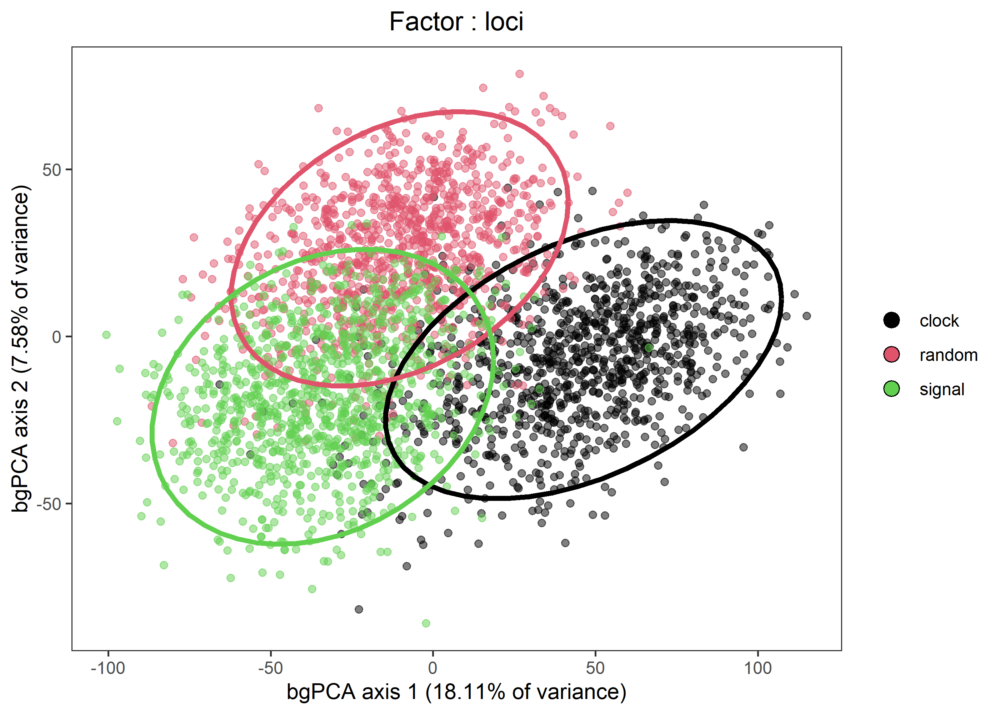
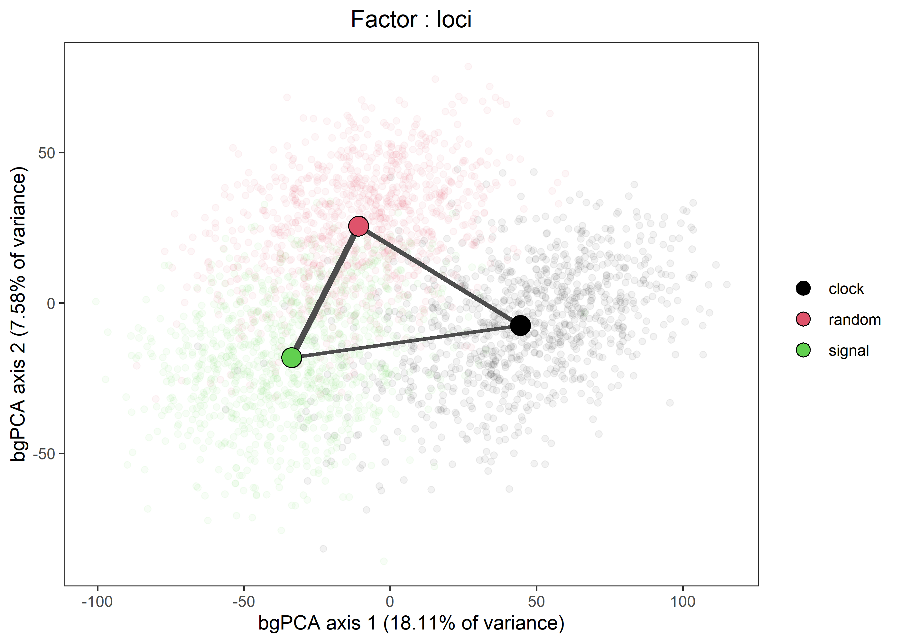
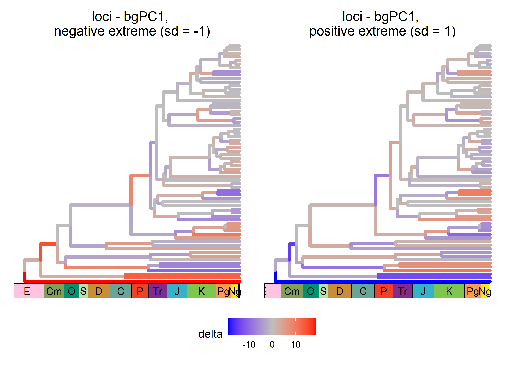
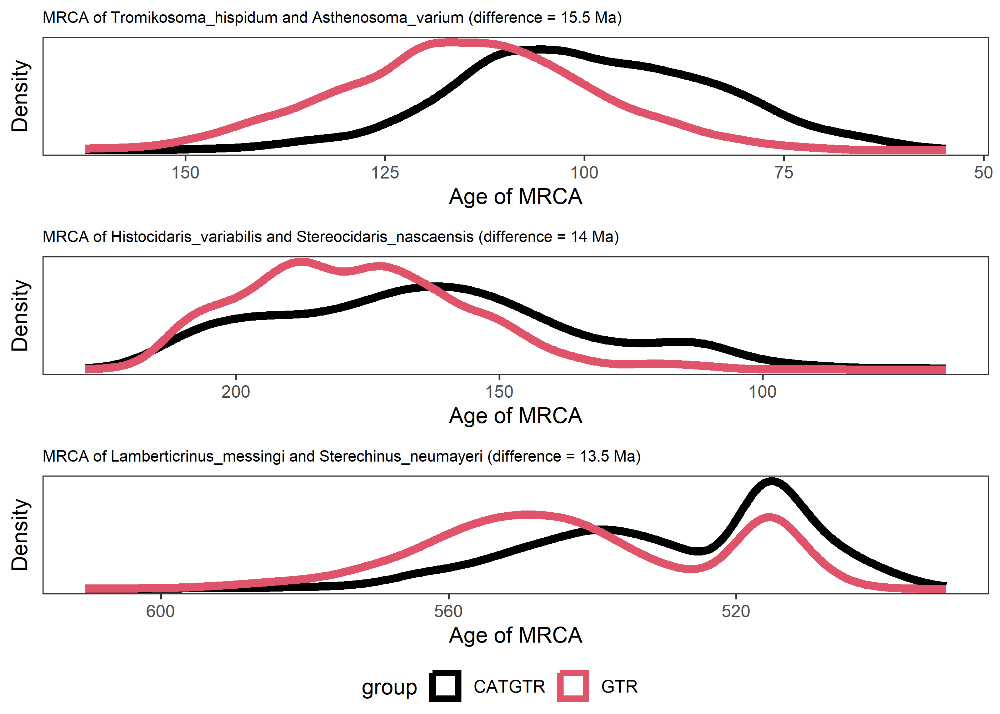
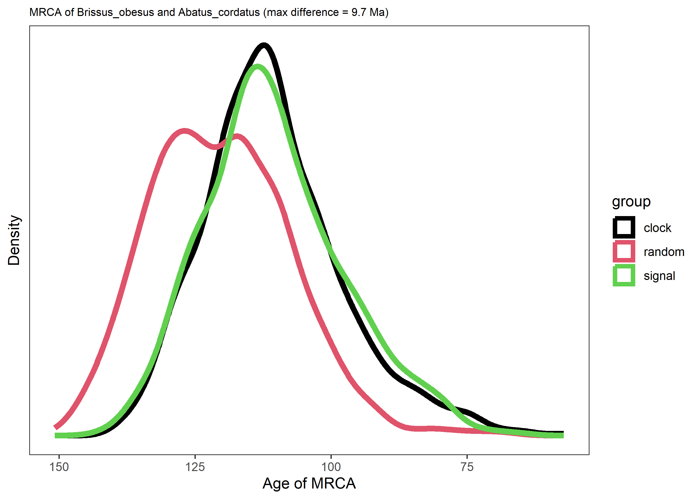
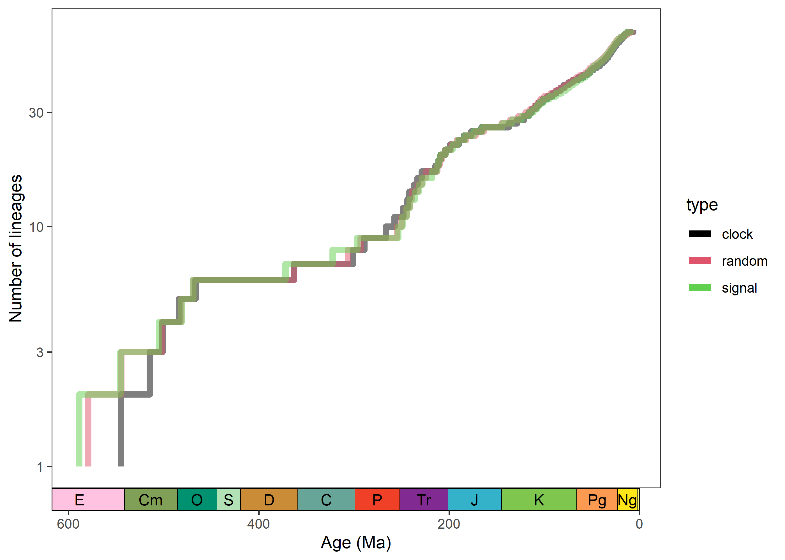

## `chronospace`: statistical exploration of time-calibrated phylogenies and the relative impact of methodological decisions.


Calibrating phylogenies to absolute time is a complex and time-consuming
task, yet it is a crucial first step in the inference of
macroevolutionary history. Bayesian approaches to time scaling
phylogenetic trees have dramatically grown in complexity, and hinge
today upon numerous methodological choices (e.g., gene sampling
strategy, type of clock, model of molecular evolution, shape of the
priors implemented on calibrated nodes, set of fossil calibrations used,
type of tree prior, etc.). Justifying all of these, or even a subset,
can be challenging and computationally intensive. As a consequence,
divergence times are routinely inferred under a limited range of
parametric conditions, often chosen arbitrarily. Attempts to measure and
summarize the sensitivity of results to such decisions rely on either
tables summarizing results for selected clades or stacking consensus
trees, but both approaches can be cumbersome to interpret, and lack a
consistent way of quantifying (and therefore comparing) the relative
effect of each choice.

`chronospace` is an R package devised to help visualizing and
quantifying the sensitivity of results to methodological decisions
through the use of chronospaces, i.e., graphical representations
summarizing variation in the node ages contained in populations of
time-calibrated trees inferred using a fixed topology. In particular,
this package uses between-groups PCA (bgPCA) to summarize variation in
node ages induced by varying specific methodological choices, and
estimates their impact using a Sum of squares (SSQ) approach for
measuring their effect sizes. Visualization of chronospaces and other
graphical tools included in `chronospace` are built with the aid of
`ggplot2` (Wickham 2016), `ggtree` (Yu 2017), and `deeptime` (Gearty
2023), among others packages.

**Note: this repository addresses the version of `chronospace` described
in [Mongiardino Koch and Milla Carmona
(2024)](https://www.biorxiv.org/content/10.1101/2024.02.04.578835v1). If
you are interested in the data and procedures described in Mongiardino
Koch et al. 2022 eLife paper (the precursor of this package), those
files are now deposited in the [chronospaces_eLife
repository](https://github.com/mongiardino/chronospaces_eLife/tree/main).**

## Installation

The development version of `chronospace` can be installed from
[GitHub](https://github.com/) using:

``` r
# install.packages("devtools")
devtools::install_github("mongiardino/chronospace")
```

## The data set

Below, the capabilities of `chronospace` are showcased using a dataset
of [echinoid node
ages](https://github.com/mongiardino/chronospaces_eLife/tree/main/example_files),
which represents of a subset of the inferences performed by [Mongiardino
Koch et al. 2022](https://elifesciences.org/articles/72460). It is
comprised of six posterior distributions of time-calibrated trees
obtained using PhyloBayes (Lartillot et al. 2013). These were all run
using the same constrained topology (as required by the `chronospace`
suite of functions), but varying two methodological decisions:

1)  **Gene subsampling strategy**: three different sets of 100 genes,
    subsampled from a larger phylogenomic data set based on their level
    of A) clock-likeness, B) phylogenetic signal, or C) selected at
    random.

2)  **Model of molecular evolution**: each gene subsample was also run
    under two models of molecular evolution, the site-homogeneous GTR+G
    and the site-heterogeneous CAT+GTR+G (Lartillot & Philippe 2004).

This setting will allow us to evaluate whether inferred ages are more
sensitive to the choice of loci or to the choice of model of molecular
evolution.

## Importing and formatting node ages data

The function `extract_ages` imports and formats temporal data from a
series of external tree files (these must be in Newick format). Each
file should represent the posterior distribution of trees obtained from
an individual run or chain, and all trees (within and among files)
should share the same tree topology. Furthermore, they should be placed
together in an folder with no other file.

`extract_ages` has three main arguments: `path` - specifying the folder
where files are stored; `type` - a list of vectors, one for each factor
being tested (in this case two, loci choice and model of evolution),
specifying the group (i.e., factor levels) to which the chronograms from
each file will be assigned to (in this case, three groups for loci
choice and two for model of evolution, see example below); and
`sample` - the fixed number of topologies to retain from each file (here
we will sample 500 trees from each file for a total of 3000 trees).

**Note: `extract_ages` will import the files in the order they appear in
the folder; the list provided in `type` must follow this same order.**

``` r
#load chronospace
library(chronospace)
#> Registered S3 methods overwritten by 'treeio':
#>   method              from    
#>   MRCA.phylo          tidytree
#>   MRCA.treedata       tidytree
#>   Nnode.treedata      tidytree
#>   Ntip.treedata       tidytree
#>   ancestor.phylo      tidytree
#>   ancestor.treedata   tidytree
#>   child.phylo         tidytree
#>   child.treedata      tidytree
#>   full_join.phylo     tidytree
#>   full_join.treedata  tidytree
#>   groupClade.phylo    tidytree
#>   groupClade.treedata tidytree
#>   groupOTU.phylo      tidytree
#>   groupOTU.treedata   tidytree
#>   is.rooted.treedata  tidytree
#>   nodeid.phylo        tidytree
#>   nodeid.treedata     tidytree
#>   nodelab.phylo       tidytree
#>   nodelab.treedata    tidytree
#>   offspring.phylo     tidytree
#>   offspring.treedata  tidytree
#>   parent.phylo        tidytree
#>   parent.treedata     tidytree
#>   root.treedata       tidytree
#>   rootnode.phylo      tidytree
#>   sibling.phylo       tidytree

#Important! Check files names, compare against type order below
list.files(temp)
#> [1] "clockCATGTR_ln_sample.datedist"  "clockGTR_ln_sample.datedist"    
#> [3] "randomCATGTR_ln_sample.datedist" "randomGTR_ln_sample.datedist"   
#> [5] "signalCATGTR_ln_sample.datedist" "signalGTR_ln_sample.datedist"

#Set type of runs and number of chronograms to be retained. 
#Name the listed elements in type to add factor names; otherwise,
#generic names will be given.
type <- list(loci = c('clock', 'clock', 'random', 'random', 'signal', 'signal'),
             model = c('CATGTR', 'GTR', 'CATGTR', 'GTR', 'CATGTR', 'GTR'))
sample <- 500

#Import data to R (this might take a minute)
data <- extract_ages(path = temp, type = type, sample = sample)
#> Check that labels are assigned correctly to the input files.
#> If there is an error, modify the order of factors in 'type'
#> or the name of input files, for the two to match.
#> 
#> file = clockCATGTR_ln_sample.datedist | type = clock - CATGTR 
#> file = clockGTR_ln_sample.datedist | type = clock - GTR 
#> file = randomCATGTR_ln_sample.datedist | type = random - CATGTR 
#> file = randomGTR_ln_sample.datedist | type = random - GTR 
#> file = signalCATGTR_ln_sample.datedist | type = signal - CATGTR 
#> file = signalGTR_ln_sample.datedist | type = signal - GTR
```

The function will organize these files into an object of class
`"nodeAges"`, containing 1) a matrix where each row is a particular tree
in the posterior distribution and each column represents the estimated
age of a given node, 2) a data frame where each methodological choice is
coded as a separate factor, and 3) the fixed topology (used for
graphical output).

``` r
#Print nodeAges object
data
#> Data from 3000 trees with 65 internal nodes (see $ages and $topology),
#> Obtained using 6 methodological pathways (see $factors).
```

## Summarizing chronospaces

The node age data stored in objects of class `"nodeAges"` can be
summarized using the `chronospace` function, which uses bgPCA to find
the major directions of variation between groups. These bgPC axes are
directions across the multivariate chronospace along which groups of
chronograms that were inferred under different conditions, such as
different models of molecular evolution (e.g., GTR+G vs CAT+GTR+G), are
maximally discriminated. The function reports the percentage of
variation explained by each factor, both in relation to the total amount
of raw variation in node ages and for each individual bgPC extracted.
This information can be used to gauge the relative importance of each
choice for the estimation of node ages.

As can be seen below, in the specific case of the echinoid data set, the
choice of loci explains a much larger fraction of the total variability
in node ages than the choice of model of molecular evolution. This can
be interpreted to mean that the choice of loci is a more important
determinant of the results obtained, having a larger effect size.
Finding ways of justifying that choice, or otherwise exploring the
uncertainty of results of interest to it, is therefore more important
than spending time/computational resources on the model of molecular
evolution.

``` r
#Summarize chronospace
cspace <- chronospace(data)
#>                 loci (%) model (%) Unaccounted (%)
#> Total variation 14.79692   4.69255        80.51053
#> _________________________________________________________________________________
#> --- Results for loci (clock/random/signal) ---
#>               loci (%) model (%) Unaccounted (%)
#> bgPC1(18.11%) 11.21472   0.11907         6.77879
#> bgPC2(7.58%)   3.58220   0.12878         3.86595
#> ---------------------------------------------------------------------------------
#> --- Results for model (CATGTR/GTR) ---
#>               loci (%) model (%) Unaccounted (%)
#> bgPC1(10.42%)  0.38288   4.69255          5.3465
#> ---------------------------------------------------------------------------------
#>  * All percentages are relative to the total amount of variation in node ages
```

Chronospaces can be also assessed using visualization tools. The `plot`
function implements methods to display scatter plots (if there are three
or more groups) or histograms (when there are only two), depicting the
distribution of trees in the space configured by bgPC axes. A few
visualization alternatives are shown below, including the use of
confidence ellipses, multivariate distances between centroids, and
opacity:

``` r
#Plot scatterplot for loci
plot(cspace, factor = 1, output = "ordination", 
     ellipses = TRUE)
```



``` r

#Plot scatterplot for loci, show distances between centroids 
#in multivariate space
plot(cspace, factor = 1, output = "ordination", 
     distances = TRUE, pt.alpha = 0.05)
```



``` r

#Plot histogram for model
plot(cspace, factor = 2, output = "ordination")
```


Another graphical output that can be generated are pairs of chronograms
showing the change in node ages at the extremes of bgPC axes. These are
equivalent to the depictions of how landmarks move as one traverses a
morphospace axis, and we therefore refer to them as chronogram warping
diagrams. Change is represented by color-coding branches according to
their degree of contraction/expansion along the bgPCA axis, depicting
the way in which different node ages are realized (i.e., are younger
ages for a given node induced by shortening of branches ahead of it, or
expansion of branches behind it):

``` r
#Plot between-models PC1 extremes 
plot(cspace, factor = 1, output = "extremes")
```



## Dissecting the effect of methodological choices

`"nodeAges"` objects can also be fed to a number of functions that help
characterize the impact of methodological choices over particular
aspects of evolutionary history.

`sensitive_nodes` plots the posterior distribution of ages for the nodes
who are most sensitive to each individual methodological choice. The
nodes most affected by varying different aspects of the analysis are
generally different. The user can either ask for a fixed number of most
affected nodes (argument `num_clades`), or specify a threshold for the
amount of change above which nodes are considered to be relevant
(arguments `amount_of_change`).

``` r
#Plot the ages distribution of the three nodes most affected by the model of 
#evolution chosen 
sensitive_nodes(echinoid_dates, num_clades = 3, factor = 2)
```



`specified_node` produces a similar output, but instead of showing the
most affected nodes it displays the distribution of posterior ages for a
particular node of interest.This node is specified by the user through
the argument `tips`, which takes a vector of length two specifying the
names of terminals used to find their most common recent ancestor.

``` r
#Plot the ages distribution of the MRCA of Brissus obesus and Abatus cordatus
#under different loci subsampling strategies
specified_node(echinoid_dates, factor = 1, 
               tips = c('Brissus_obesus', 'Abatus_cordatus'))
```



Finally, `ltt_sensitivity` allows exploring the impact of methodological
choices on diversification rates by displaying separate
lineage-through-time curves for each level of a particular factor.
Averaging node ages across subsamples of chronograms can be computed
using either the mean or the median (argument `summary`)

``` r
#Plot lineage through time plots for each model of evolution
ltt_sensitivity(echinoid_dates, factor = 1, 
                summary = "median", gscale = TRUE)
```



## References

Gearty W. (2023). *deeptime: Plotting Tools for Anyone Working in Deep
Time*. R package version 1.0.1,
<https://CRAN.R-project.org/package=deeptime>.

Lartillot N., & Philippe H. (2004). *A Bayesian mixture model for
across-site heterogeneities in the amino-acid replacement process*. Mol.
Biol. Evol. 21, 1095–1109. <https://doi.org/10.1093/molbev/msh112>.

Lartillot N., Rodrigue N., Stubbs D., & Richer J. (2013). *PhyloBayes
MPI. Phylogenetic reconstruction with infinite mixtures of profiles in a
parallel environment*. Syst. Biol. 62, 611–615.
<https://doi.org/10.1093/sysbio/syt022>.

Mongiardino Koch N. & Milla Carmona P. (2024). *Chronospaces: an R
package for the statistical exploration of divergence times reveals
extreme dependence on molecular clocks and gene choice*. bioRxiv
2024.02.04.578835. <https://doi.org/10.1101/2024.02.04.578835>.

Mongiardino Koch N., Thompson J.R., Hiley A.S., McCowin M.F., Armstrong
A.F., Coppard S.E., Aguilera F., Bronstein O., Kroh A., Mooi, R. & Rouse
G.W. (2022). *Phylogenomic analyses of echinoid diversification prompt a
re-evaluation of their fossil record*. Elife, 11, e72460.
<https://doi.org/10.7554/eLife.72460>.

Wickham H. (2016). *ggplot2: Elegant Graphics for Data Analysis*.
Springer-Verlag New York.

Yu G., Smith D.K., Zhu H., Guan Y., & Lam T.T.Y. (2017). *ggtree: an R
package for visualization and annotation of phylogenetic trees with
their covariates and other associated data*. MEE, 8(1), 28-36.
<https://doi.org/10.1111/2041-210X.12628>.
